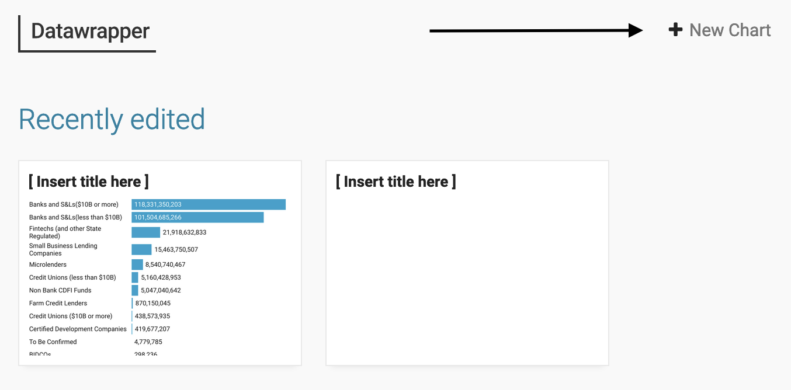
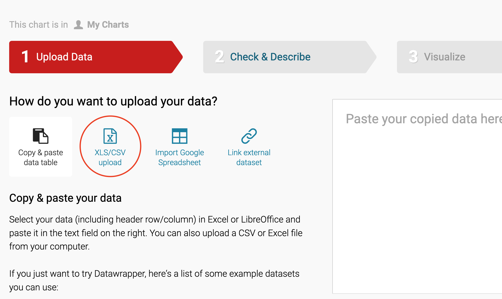
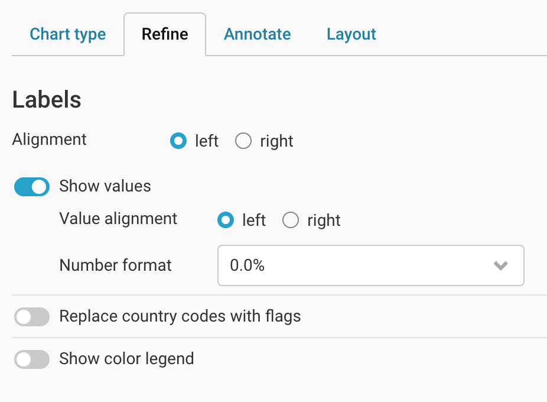
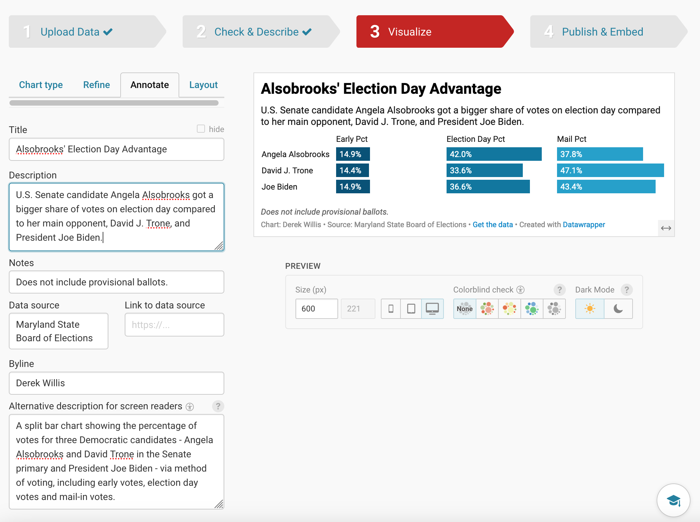
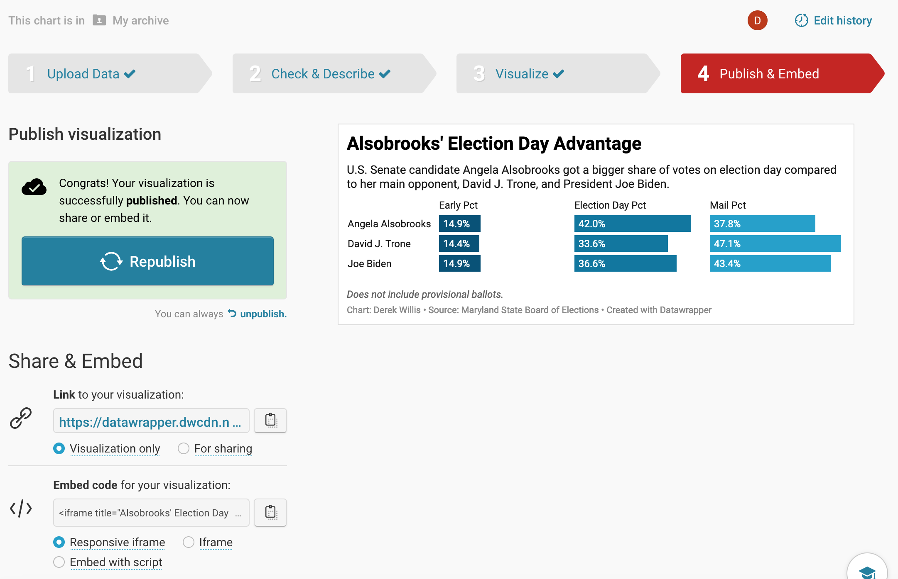
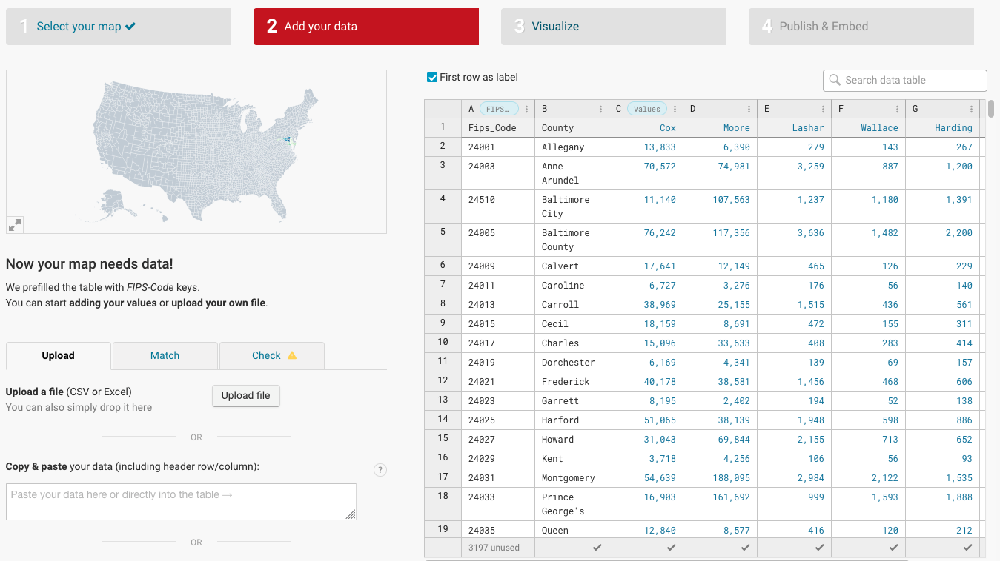
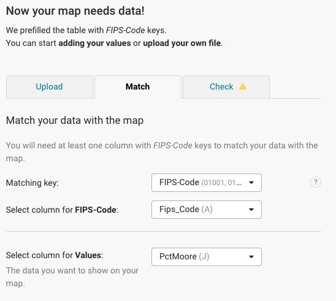

 ---
title: "pre_lab_09.Rmd"
author: "derek willis"
date: "2024-08-14"
output: html_document
---

```{r setup, include=FALSE}
knitr::opts_chunk$set(echo = TRUE)
```

We'll continue our chart-making adventure today with Datawrapper, a free tool that many newsrooms use to create graphics, maps and tables. You should have your Datawrapper account setup. Let's start with a simple bar chart using data from the 2024 Democratic primary in Prince George's County. We have a CSV file of the percentage of votes cast by voting method (early, election day and mail) for three candidates in the Democratic primary in Prince George's County: Joe Biden (President) and Angela Alsobrooks and David Trone (U.S. Senate).

Alsobrooks was the winner in the Senate race, but that wasn't a clear-cut outcome a few weeks before the election. Trone had a well-financed early turnout operation, so looking at how votes were cast (before election day or on it) should shed some light on how Alsobrooks won.

### Task 1: Load libraries and settings

**Task** Run the following code in the gray-colored codeblock below to load the tidyverse library

```{r}
library(tidyverse)
library(janitor)
```

### Task 2: Get 2024 Democratic primary data

First, let's get some data and work with it. Let's load and look at it.

**Task** Load the CSV file

```{r}
dem_cands <- read_csv("data/md_dem_cands.csv")
```

### Task 3: Log into Datawrapper

**Task** Log into [datawrapper.de](https://www.datawrapper.de/). Once logged in, you'll click on New Chart.

```{r, echo=FALSE}

```

### Task 4: Upload the CSV File

The first thing we'll do is upload the pg_cands.csv file that's in the pre_lab_10/data folder.

**Task** Click on XLS/CSV and upload the pg_cands.csv file.

```{r, echo=FALSE}

```

### Task 5: Inspect the Data

Next up is to check and see what Datawrappper did with our data when we uploaded it. As you can see from the text on the left, if it's blue, it's a number. If it's green, it's a date. If it's black, it's text. Red means there's a problem. This data is very clean, so it imports cleanly.

**Task** Look at the uploaded data, then click on the "Proceed" button.

```{r, echo=FALSE}
knitr::include_graphics(rep("images/datawrapper3.png"))
```

### Task 6: Make a Chart

Now we make a chart. Datawrapper will try to pick a chart type, but you should have an idea of what you want that's based on the data. In this case, we have three categories for each candidate, so we could choose Stacked Bars or Split Bars. Let's go with the latter.

**Task** Click on Refine. Let's make sure that the percentages are actually formatted as percentages:

```{r, echo=FALSE}

```

### Task 7: Annotate the Chart

Now we need to annotate our chart. Every chart needs a title, a source line and a credit line. Most need chatter (called `description` here).

**Task** Click on the "Annotate" tab to get add the title and description. Really think about the title and description: the title is like a headline and the description is provides some additional context. Another way to think about it: the title is the most important lesson from the graphic, and the description could be the next most important lesson or could provide more context to the title.

```{r, echo=FALSE}

```

You also need to add "alt-text", or the alternative description for screen reader software that assists those with vision difficulties. Alt text should describe the chart.

### Task 7: Publish the Chart

**Task** Datawrapper offers several ways for you to get your chart in front of readers. The first is to publish it, which gives you access to a unique URL and embed codes that should work with content management systems such as WordPress. Click the "Publish & Embed" tab and then click the "Publish" button, and you'll see something like this:

```{r, echo=FALSE}

```

Some publication systems allow for the embedding of HTML into a post or a story. Some don't. The only way to know is to ask someone at your publication. Every publication system on the planet, though, can publish an image. So there's always a way to export your chart as a PNG file, which you can upload like any photo.

To do that, click on the "PNG" icon. Finally, click the "Download image" button.

**Answer** Copy the url of the graphic you published here. It will begin with <https://datawrapper.dwcdn.net/>. Don't copy the browser's current url.

### Task 8: Make a Choropleth Map

Let's create a choropleth map - one that shows variations between the percentage of votes received by Wes Moore across Maryland counties in 2022. We'll read that in from the data folder.

**Task** Run the following code to load the Maryland election results data.

```{r}
md_gov_county <- read_csv("data/md_gov_county.csv")
```

In order to make a map, we need to be able to tell Datawrapper that a certain column contains geographic information (besides the name of the county). The easiest way to do that for U.S. maps is to use something called a [FIPS Code](https://www.census.gov/programs-surveys/geography/guidance/geo-identifiers.html). You should read about them so you understand what they are, and think of them as a unique identifier for some geographical entity like a state or county. Our md_gov_county dataframe has a FIPS code for each county, but if you ever need one for a county, this is a solved problem thanks to the Tigris library that we used in pre_lab 9.

**Task** Write code to add columns showing the total number of votes for each county and the percentage of votes received by Wes Moore in each county (you did this in Lab 9!), then replace the CSV file in the data folder with it.

```{r}

# calculate the total number of votes and Moore's percentage, saving it back to the md_gov_county dataframe

write_csv(md_gov_county, "data/md_gov_county.csv")
```

**Task** Go back to Datawrapper and click on "New Map". Click on "Choropleth map" and then choose "USA \>\> Counties (2022)" for the map base and click the Proceed button.

**Task** Now we can upload the `md_gov_county.csv` file from our data folder using the Upload File button. It should look like the following image:

```{r, echo=FALSE}

```

We'll need to make sure that Datawrapper understands what the data is and where the FIPS code is.

**Task** Click on the "Match" tab and make sure that yours looks like the image below (your column for Moore's percentage may have a different name):

```{r, echo=FALSE}

```

**Task** Click the "Proceed" button (you should have to click it twice, since the first time it will tell you that there's no data for 3,197 counties - the rest of the U.S.). That will take you to the Visualize tab.

You'll see that the map currently is of the whole nation, and we only have Maryland data. Let's fix that.

**Task** Look for "Hide regions without data" under Appearance, and click the slider icon to enable that feature. You should see a map zoomed into Maryland with some counties in various colors. **Answer** Describe the changes from the previous map

But it's a little rough visually, so let's clean that up.

**Task** Look for the "Show color legend" label and add a caption for the legend, which is the horizontal bar under the title. It represents the extent of the data from smallest number of loans to largest. Then click on the "Annotate" tab to add a title, description, data source and byline. The title should represent the headline, while the description should be a longer phrase that tells people what they are looking at.

That's better, but check out the tooltip by hovering over a county. It's not super helpful. Let's change the tooltip behavior to show the county name and a better-formatted number.

**Task** Click the "Customize tooltips" button so it expands down. Change {{ fips_code }} to {{ county }} and {{ pctmoore }} to {{ FORMAT(pctmoore, "00.0%")}} **Answer** Describe the changes from the previous map

**Task** Add a note that says that this data represents votes counted through Nov. 10 and an alternative description for screen readers. This should be a simple description of what your map shows. Experiment with the "Show labels" button, choosing the "by column" option for Type to display some or all of the county names.

Ok, that looks better. Let's publish!

**Task** Click the "Proceed" button until you get to the "Publish & Embed" tab, then click "Publish Now". Copy the published URL (like you did for the chart above) and paste it below. **Answer** Put the URL of your map here.
