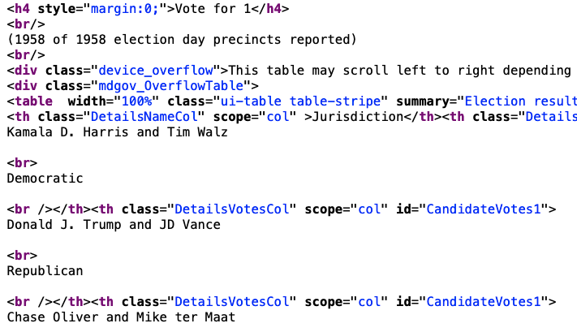
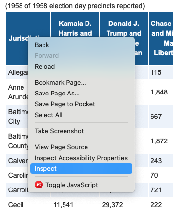

```{r setup, include=FALSE}
knitr::opts_chunk$set(echo = TRUE)
```

# Scraping data with Rvest

Sometimes, governments put data online on a page or in a searchable database. And when you ask them for a copy of the data underneath the website, they say no.

Why? Because they have a website. That's it. That's their reason. They say they don't have to give you the data because they've already given you the data, never mind that they haven't given to you in a form you can actually load into R with ease.

Lucky for us, there's a way for us to write code to get data even when an agency hasn't made it easy: webscraping.

One of the most powerful tools you can learn as a data journalist is how to scrape data from the web. Scraping is the process of programming a computer to act like a human that opens a web browser, goes to a website, ingests the HTML from that website into R and turns it into data.

The degree of difficulty here goes from "Easy" to "So Hard You Want To Throw Your Laptop Out A Window." And the curve between the two can be steep. You can learn how to scrape "Easy" in a day. The hard ones take a little more time, but it's often well worth the effort because it lets you get stories you couldn't get without it.

In this chapter, we'll show you an easy one.

We're going to use a library called `rvest`, which you can install it the same way we've done all installs: go to the console and `install.packages("rvest")`.

Like so many R package names, rvest is a bad pun. You're supposed to read it to sound like "harvest", as in "harvesting" information from a website the same way you'd harvest crops in a field.

### Task 1: Load libraries and settings

**Task** Run the following code in the gray-colored codeblock below to load the libraries we'll use

```{r}
#| output: false
library(rvest)
library(tidyverse)
library(janitor)
```

For this example, we're going to work on loading a simple table of data from the Maryland State Board of Elections. This is a table of unofficial county-level election results for the Presidential race from the November general election.

Let's suppose we can't find a table like that for download, but we do see a version on the SBOE website at this URL: <https://elections.maryland.gov/elections/2024/general_Results/gen_detail_results_2024_1_1.html>.

```{r, echo=FALSE}
knitr::include_graphics(rep("images/rvest1.png"))
```

We could get this table into R with the following manual steps: highlighting the text, copying it into Excel, saving it as a csv, and reading it into R. Or, we could write a few lines of webscraping code to have R do that for us!

In this simple example, it's probably faster to do it manually than have R do it for us. But during the time when ballots are being counted, this table is likely to change, and we don't want to keep doing manual repetitive tasks.

Why would we ever write code to grab a single table? There's several reasons:

1.  Our methods are transparent. If a colleague wants to run our code from scratch to factcheck our work, they don't need to repeat the manual steps, which are harder to document than writing code.
2.  Let's suppose we wanted to grab the same table every day, to monitor for changes. Writing a script once, and pressing a single button every day is going to be much more efficient than doing this manually every day.
3.  If we're doing it manually, we're more likely to make a mistake, like maybe failing to copy every row from the whole table.
4.  It's good practice to prepare us to do more complex scraping jobs. As we'll see in the next chapter, if we ever want to grab the same table from hundreds of pages, writing code is much faster and easier than going to a hundred different pages ourselves and downloading data.

So, to scrape, the first thing we need to do is start with the URL. Let's store it as an object called pres_url.

### Task 2: Save the URL as a variable

**Task** Run the following code in the gray-colored codeblock below to save the URL

```{r}
pres_url <- "https://elections.maryland.gov/elections/2024/general_Results/gen_detail_results_2024_1_1.html"
```

When we go to the web page, we can see a nicely-designed page that contains our information.

But what we really care about, for our purposes, is the html code that creates that page.

In our web browser, if we right-click anywhere on the page and select "view source" from the popup menu, we can see the source code. Or you can just copy this into Google Chrome: <view-source:https://elections.maryland.gov/elections/2024/general_Results/gen_detail_results_2024_1_1.html>.

Here's a picture of what some of the source code looks like.

```{r, echo=FALSE}

```

We'll use those HTML tags -- things like `<table>` and `<tr>` -- to grab the info we need.

Okay, step 1.

Let's write a bit of code to tell R to go to the URL for the page and ingest all of that HTML code. In the code below, we're starting with our URL and using the read_html() function from rvest to ingest all of the page html, storing it as an object called results.

### Task 3: Ingest the HTML from the URL

**Task** Run the following code in the gray-colored codeblock below to save the HTML from that URL as a variable

```{r}
# read in the html
results <- pres_url |>
  read_html()

# display the html below
results

```

If you're running this code in R Studio, in our environment window at right, you'll see results as a "list of 2".

This is not a dataframe, it's a different type of data structure a "nested list."

If we click on the name "results" in our environment window, we can see that it's pulled in the html and shown us the general page structure. Nested within the `<html>` tag is the `<head>` and `<body>`, the two fundamental sections of most web pages. We're going to pull information out of the `<body>` tag in a bit.

```{r, echo=FALSE}
knitr::include_graphics("images/rvest3.png")
```

Now, our task is to just pull out the section of the html that contains the information we need.

But which part do we need from that mess of html code? To figure that out, we can go back to the page in a web browser like chrome, and use built in developer tools to "inspect" the html code underlying the page.

On the page, find the data we want to grab -- "Vote for 1" - and right click on the word "Jurisdiction" in the column header of the table. That will bring up a dropdown menu. Select "Inspect", which will pop up a window called the "element inspector" that shows us where different elements on the page are located, what html tags created those elements, and other info.

```{r, echo=FALSE}

```

The entire table that we want of results is actually contained inside an html `<table>`. It has a `<tbody>` that contains one row `<tr>` per county.

Because it's inside of a table, and not some other kind of element (like a `<div>`), rvest has a special function for easily extracting and converting html tables, called html_table(). This function extracts all the html tables on the page, but this page only has one so we're good.

### Task 4: Extract tables from the HTML source

**Task** Run the following code in the gray-colored codeblock below to extract all tables in the HTML as a variable

```{r}
# read in the html and extract all the tables
results <- pres_url |>
  read_html() |>
  html_table()

# show the dataframe

results
```

In the environment window at right, look at results Note that it's now a "list of 1".

This gets a little complicated, but what you're seeing here is a nested list that contains one data frame -- also called tibbles -- one for each table that exists on the web page we scraped.

So, all we need to do now is to store that single dataframe as an object. We can do that with this code, which says "keep only the first dataframe from our nested list."

### Task 5: Save one table from the HTML source

**Task** Run the following code in the gray-colored codeblock below to extract all tables in the HTML and save it as a dataframe. What do you notice about the columns? **Answer**

```{r}
# Read in all html from table, store all tables on page as nested list of dataframes.
results <- pres_url |>
  read_html() |>
  html_table()

# Just keep the first dataframe in our list

results <- results[[1]]

# show the dataframe

results
```

We now have a proper dataframe, albeit with some lengthy column headers.

From here, we can do a little cleaning. First we'll use clean_names() to lower the column names. Then use rename() to replace the candidate column names with simpler versions. We can just use the column positions instead of writing out the full names, which is nice.

Then let's use slice() to remove the last row -- row number 25 -- which contains totals and percentages that we don't need. Finally, we'll make sure the vote tallies are numbers using mutate and `gsub()`, which we use to replace all the commas with nothing.

### Task 6: Clean up the data

**Task** Run the following code to extract the table we want, clean up the names and remove the total row. Look at the rename() function - what do you think the numbers 2 through 6 are referring to? **Answer**

```{r}
# Read in all html from table, get the HTML table.
results <- pres_url |>
  read_html() |>
  html_table()

# Standardize column headers, remove last row

results <- results[[1]] |>
  clean_names() |>
  rename(harris = 2, trump = 3, oliver = 4, stein = 5, kennedy = 6) |>
  slice(-25) |>
  mutate(harris = as.numeric(gsub(",","", harris))) |>
  mutate(trump = as.numeric(gsub(",","", trump))) |>
  mutate(oliver = as.numeric(gsub(",","", oliver))) |> 
  mutate(stein = as.numeric(gsub(",","", stein))) |> 
  mutate(kennedy = as.numeric(gsub(",","", kennedy))) |> 
  select(-sharon_e_harris_write_in_democratic)

# show the dataframe
results

```

And there we go. We now have a nice tidy dataframe of Maryland presidential election results that we could ask some questions of.

What about HTML that doesn't have a table? Well, that's where things get a bit more complicated, and rely on your ability to read HTML and identify particular elements of it.

Let's consider the list of U.S. House Committees on house.gov: <https://www.house.gov/committees>. Let's save that URL as a variable as we did above:

### Task 7: Save the URL as a variable

**Task** Run the following code in the gray-colored codeblock below to save the URL

```{r}
cmtes_url <- "https://www.house.gov/committees"
```

The next step is similar to before, too, except this time we're not going to call `html_table()` because there are no tables here that we want. In order to find what we want, we'll need to right-click on the first red dot next to "Agriculture" and choose "Inspect":

### Task 8: Inspect the HTML elements

**Task** Right-click on the first red dot next to "Agriculture" and choose "Inspect". You should see multiple <li> tags inside a <ul> tag.

One reason that we use HTML elements like ul and li is to help organize the code and make it easier to maintain. But it also helps with scraping, because we can zero in on the elements we want. Let's start by reading it in:

### Task 9: Read the HTML source

**Task** Run the following code in the gray-colored codeblock below to save the HTML as a variable

```{r}
cmte_results <- cmtes_url |>
  read_html()

# show the result
cmte_results
```

Once again we get a list of two as our result. In this case, we don't want to isolate the first item in our list. Instead, we want to try to locate all of the `li` tags inside this HTML. Since the `li` tag is an HTML element, we use the function `html_elements()` to get them. If we only wanted a single element, we'd use `html_element()`:

### Task 10: Isolate the list of `li` tags inside the HTML using `html_elements`

**Task** Run the following code in the gray-colored codeblock below to find the <li> tags. What does the output suggest about how many <ul> tags there are in the HTML source? **Answer**

```{r}
cmte_results |> html_elements('li')
```

Good news and bad news here: we have all of the <li> tags, but we have lots of them, and it's hard to see any of the committees. Let's see what we're dealing with and just look at the text *inside* the <li>

tags. To do that, we add `html_text()` to the end of the last code block:

### Task 10: Isolate the text of `li` tags inside the HTML using `html_text`

**Task** Run the following code in the gray-colored codeblock below to find the text inside <li> tags. Describe the output: **Answer**

```{r}
cmte_results |> html_elements('li') |> html_text()
```

Ok, so now we can see the committee names. But they are surrounded by a bunch of things we don't want, and this *still* isn't a dataframe. Let's solve the second problem first with the `tibble()` function, and use `html_attr` to look for the 'href' value inside the `a` tags.

### Task 11: Turn the contents of the <li> and <a> tags into a dataframe **Task** Run the following code in the gray-colored codeblock below to make a dataframe. Describe the output: **Answer**

```{r}
committees <- cmte_results |> html_elements("li a")

committees_with_urls <- tibble(
  name = committees %>% html_text(trim = TRUE),
  url = committees %>% html_attr("href")
)
```

Now we're getting closer. The rows in this dataframe we don't want begin with a backslash. Let's get rid of those using `filter()`:

### Task 12: Remove the rows we don't need from our dataframe

**Task** Run the following code in the gray-colored codeblock below to remove the unwanted rows from our dataframe:

```{r}
committees_with_urls <- committees_with_urls |> 
  # filter out rows that begin with a backslash character
  filter(!str_detect(url, "^/"))
```

And now you have the committee names and urls.
